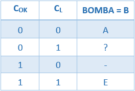
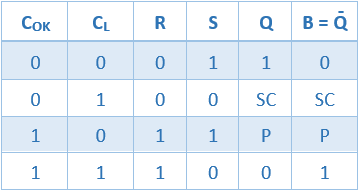
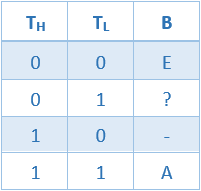
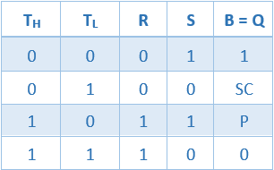
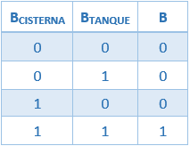
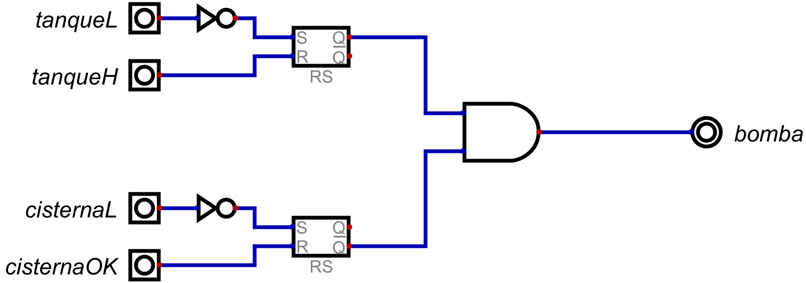

# Informe de Desarrollo de un Controlador Digital de Bomba de Agua

Electrónica IV - TP - Automatismos y Máquinas Elementales

## Introducción

El controlador de bomba de agua  es un dispositivo diseñado para regular el funcionamiento de la bomba de agua, es decir la enciende o apaga según las circunstancias que se den. La bomba de agua es la que va a cargar el tanque de agua desde una cisterna.
En nuestro caso, la bomba se encenderá cuando haya suficiente agua en la cisterna y se apagará una vez llenado el tanque. Sólo volverá a prenderse si el tanque se descarga hasta un nivel mínimo, sin llegar a descargarse totalmente.

## Metodología de trabajo

Para empezar a diseñar el circuito del controlador de bomba, analizaremos las principales funciones de la bomba: la bomba se enciende (E) cuando hay suficiente agua en la cisterna y la bomba se apaga (A) cuando se llena el tanque. 

Nos enfocaremos en el momento en que la bomba esté encendida para los casos: tanque de agua bajo; cisterna baja. Encenderemos la bomba cuando estos casos se den en simultáneo, de lo contrario quedará apagada. Para el caso de cisterna baja, esto se dará cuando los led CisternaOK y CisternaL estén ambos encendidos. Entonces:

Ahora analizaremos qué sucede con los estados del medio. Cuando Cok=1 y CL=0, no definimos ninguna salida ya que no es un estado posible, no puede estar encendido el led de arriba con el mínimo apagado. En cambio, cuando Cok=0 y CL=1, tendremos dos opciones: la cisterna se está cargando (bomba apagada) o la cisterna se está descargando (bomba encendida). Por lo tanto, tendremos que fijarnos las condiciones para saber en qué estado se mantiene la bomba.

Debido al último caso, nos será de óptima utilización un Flip Flop, el cual nos permitirá almacenar y mantener los datos sobre la cisterna para ver si la bomba se enciende (1) o se apaga (0) (en cuál de sus dos estados permanece). Utilizaremos el Flip Flop RS, donde a la entrada Reset se le conectará Cok, a la entrada Set se le conectará CL negada y la salida Q negada será la de la Bomba:

donde SC = si cambios (mantiene su estado) y P = prohibido.

Para el caso de tanque de agua bajo seguiremos el mismo procedimiento y analizaremos cuándo la bomba está encendida: cuando el nivel de agua en tanque llega al mínimo, es decir, los led TH y TL están apagados, la bomba se enciende. Entonces:

Analizamos qué sucede con los estados del medio. Cuando TH=1 y TL=0, no definimos ninguna salida ya que no es un estado posible, no puede estar encendido el led de arriba con el mínimo apagado. En cambio, cuando TH=0 y TL=1, tendremos dos opciones: el tanque se está cargando (bomba encendida hasta llegar al máximo) o el tanque se está descargando (bomba apagada hasta llegar al mínimo). 

Al igual que el caso de la cisterna, utilizaremos un elemento de memoria para recordar en qué estado se encuentra la bomba cuando TH=0 y TL=1. También utilizaremos un Flip Flop RS, donde a la entrada Reset se le conectará TH, a la entrada Set se le conectará TL negada y la salida Q en este caso será la de la Bomba:

Para finalizar, como habíamos mencionado que la bomba se enciende cuando hay una simultaneidad, es decir cuando B en la cisterna valga 1 y B en el tanque valga 1, debemos hallar el análisis final que involucre ambas variables. Para ello, utilizaremos una compuerta lógica and, entonces nos quedaría:

## Resultados

Como resultado de nuestro análisis, llegamos al siguiente circuito:

En base a esto, cuando realizamos la simulación, podemos comprobar que la bomba funciona de acuerdo a las instrucciones dadas para el tanque y para la cisterna.

## Conclusiones

Concluimos que el control de bomba de agua desarrollado es un automatismo ya que es un mecanismo que funciona por sí solo, es decir, cumple con la función de encender y apagar la bomba según las instrucciones que le dimos, sin necesidad de intervenir manualmente.
