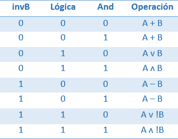
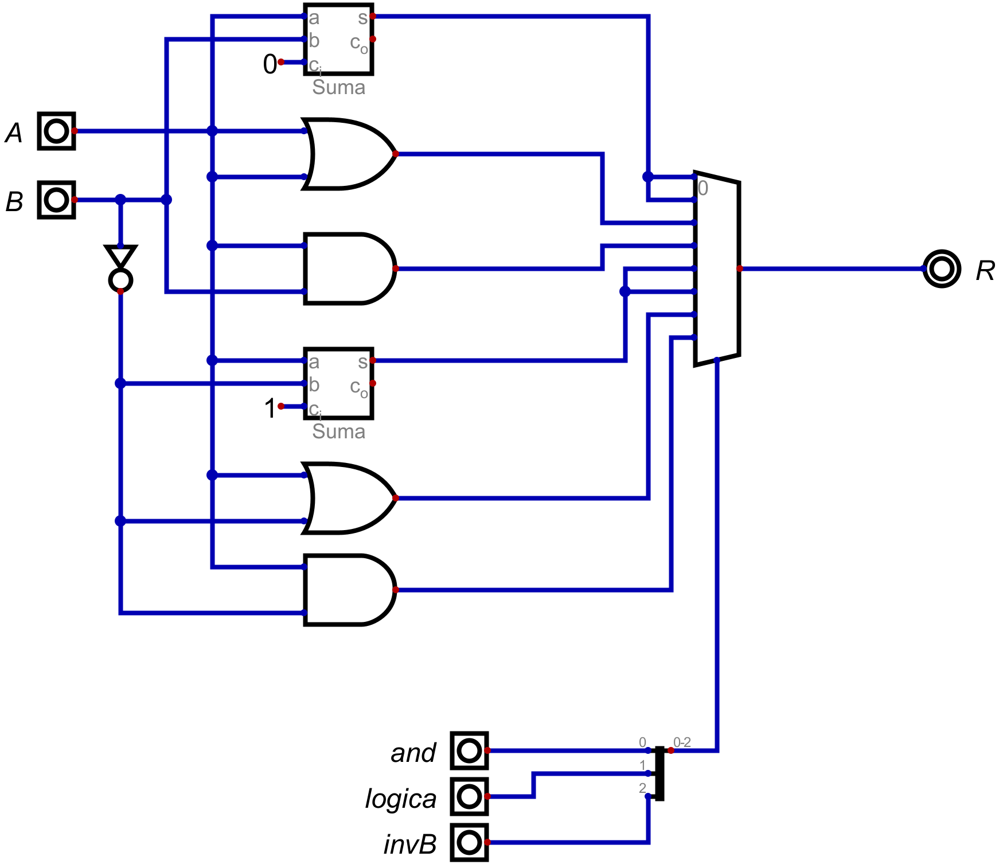
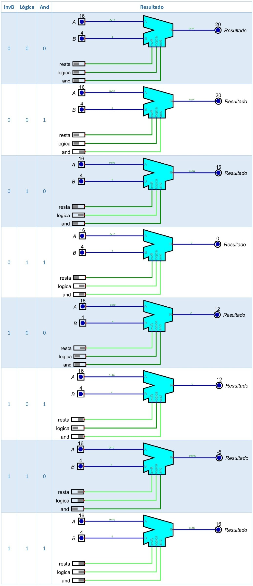

# Informe de Desarrollo de una Unidad Aritmética Lógica (ALU) de 16 bit

Electrónica IV - TP - Automatismos y Máquinas Elementales

## Introducción

La Unidad Aritmético Lógica, también conocida como ALU por sus siglas en inglés, es un circuito combinacional capaz de realizar operaciones aritméticas (suma, resta, multiplicación, etc.) y lógicas (si, y, o, no) entre dos palabras de n bits. Para los procesadores modernos, el formato para procesar las palabras casi siempre es la representación del número binario en complemento a dos y el tipo de operaciones a realizar entre ambas palabras es elegido mediante entradas de control de la ALU.

## Metodología de trabajo

Para diseñar la ALU, primero realizaremos una tabla para ver cómo trabaja la misma según las funciones que tiene:

A partir de la tabla podemos armar el diseño interno de la ALU. Emplearemos un sumador para la operación de suma. Para la resta, recordamos que:

Por lo tanto, podemos usar un sumador para la operación de resta, donde la entrada del carry será 1. Para negar B usaremos un inversor.

Para las operaciones de lógica, usaremos compuertas lógicas and (ʌ) y or (v).

Para elegir la operación a realizar, se debe contar con un selector que seleccione las funciones invB, lógica y/o and. Para ello utilizaremos un multiplexor de 3x8 (3 entradas de control y 8 entradas de datos) donde su salida sea el resultado que se busca. Los circuitos mencionados se conectan en las entradas del multiplexor y el orden de estas se acomoda de acuerdo a la tabla de verdad. Para elegir entre los distintos modos de operación, utilizamos el cable divisor de Digital, donde cada operación tendrá un bit y juntos formarán los 3 bits de selección.

El circuito empleado será el siguiente:

## Resultados

Habiendo empleado el circuito final, simulamos la ALU. Para el mismo utilizamos los valores A = 16 y B = 4 y se observan los siguientes resultados:

## Conclusiones

Concluimos que la ALU desarrollada es una máquina elemental ya que es un mecanismo que creamos con un fin determinado, donde nuestras instrucciones se convertiran en los resultados de las funciones elementales básicas que la componen.
